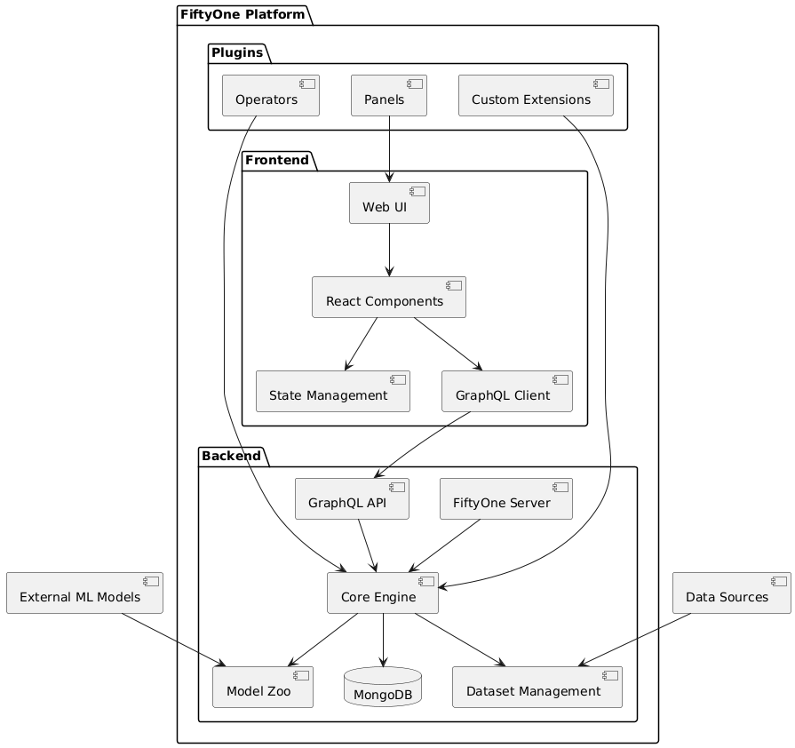
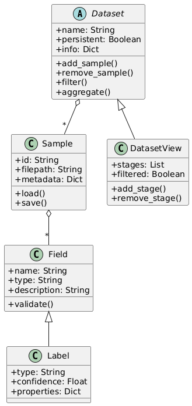

# FiftyOne Architecture

## System Architecture

FiftyOne follows a modern client-server architecture with a Python backend and a React-based frontend. The system is designed to be modular, extensible, and scalable.

### Key Components

#### Frontend
- **Web UI**: React-based user interface
- **Components**: Reusable UI components for visualization and interaction
- **State Management**: Centralized state management using Recoil and Relay
- **GraphQL Client**: Apollo Client for efficient data fetching

#### Backend
- **FiftyOne Server**: Main server component handling requests
- **Core Engine**: Core functionality for dataset operations
- **Dataset Management**: Handles dataset CRUD operations
- **Model Zoo**: Integration with pre-trained models
- **GraphQL API**: API layer for frontend communication
- **MongoDB**: Primary data store

#### Plugins
- **Operators**: Custom dataset operations
- **Panels**: UI extensions
- **Custom Extensions**: User-defined functionality

## Data Flow

1. User interacts with the Web UI
2. Frontend components update local state
3. GraphQL queries/mutations are sent to the backend
4. Backend processes requests through the Core Engine
5. Results are stored in MongoDB
6. Updates are sent back to the frontend
7. UI is updated to reflect changes

## Technology Stack

### Frontend Technologies
- React
- Recoil (State Management)
- Relay (GraphQL Client)
- Material-UI (Component Library)
- TypeScript

### Backend Technologies
- Python
- FastAPI
- GraphQL
- MongoDB
- PyTorch (for ML operations)

### Development Tools
- Yarn (Package Management)
- ESLint (Code Linting)
- Pytest (Testing)
- Docker (Containerization)

## Communication Protocol

FiftyOne uses GraphQL as its primary communication protocol between frontend and backend. This enables:

- Efficient data fetching
- Type-safe API contracts
- Real-time updates
- Flexible query capabilities

## Security Architecture

- Authentication via session tokens
- Role-based access control
- Secure API endpoints
- Data encryption in transit
- Optional SSO integration

## Extensibility

FiftyOne can be extended through:

1. **Plugins**: Custom functionality modules
2. **Operators**: Dataset transformation operations
3. **UI Components**: Custom visualization panels
4. **API Extensions**: Custom endpoints and operations

## Core Classes

The core data structures in FiftyOne follow object-oriented design principles:

### Key Classes
- **Dataset**: Main container for samples and metadata
- **Sample**: Individual data items (images, videos, etc.)
- **DatasetView**: Filtered/transformed views of datasets
- **Field**: Data schema definitions
- **Label**: Annotations and model predictions

## Performance Considerations

- Lazy loading of dataset samples
- Caching of frequently accessed data
- Efficient database indexing
- Asynchronous operations for long-running tasks
- Resource management for large datasets
