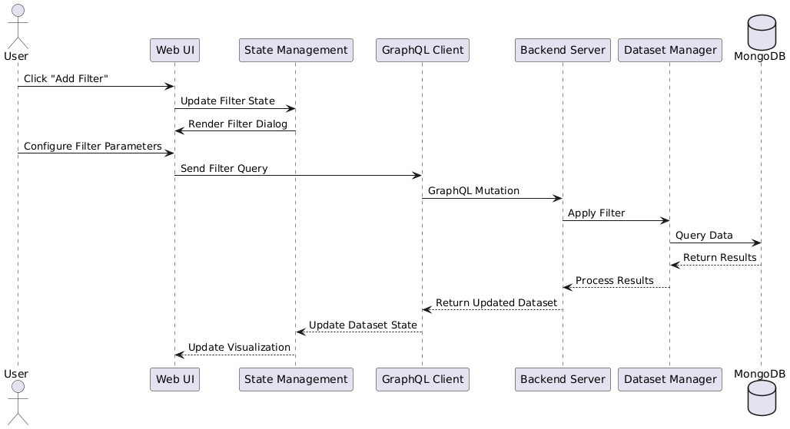

# FiftyOne Workflows

This document describes the main workflows and operations in FiftyOne.

## Dataset Management

### Creating a Dataset
1. Import dataset from directory
2. Load from supported formats (COCO, VOC, etc.)
3. Create dataset programmatically
4. Import from cloud storage

### Dataset Operations
- Adding/removing samples
- Modifying metadata
- Merging datasets
- Exporting datasets

## Filter Operations

FiftyOne provides powerful filtering capabilities for dataset management.

### Adding a Filter

1. Click the "Add Filter" button in the UI
2. Select filter type:
   - Field filter
   - Label filter
   - Metadata filter
   - Custom filter
3. Configure filter parameters
4. Apply filter to dataset
5. View filtered results

### Filter Types

#### Field Filters
- Numeric range filters
- String matching
- Date/time filters
- Boolean filters

#### Label Filters
- Classification confidence
- Detection thresholds
- Segmentation masks
- Custom label criteria

#### Metadata Filters
- File properties
- Image/video attributes
- Custom metadata fields

## Model Analysis

### Model Evaluation
1. Load model predictions
2. Compare with ground truth
3. Calculate metrics
4. Visualize results

### Performance Analysis
1. View confusion matrices
2. Analyze error cases
3. Examine edge cases
4. Generate reports

## Sample Management

### Sample Operations
1. View sample details
2. Edit annotations
3. Add/remove labels
4. Update metadata

### Batch Operations
1. Select multiple samples
2. Apply bulk updates
3. Export selected samples
4. Delete samples

## Data Visualization

### Visualization Types
- Image grids
- Video players
- Label overlays
- Metadata tables
- Charts and plots

### Custom Visualizations
1. Create custom panels
2. Configure display options
3. Add interactive elements
4. Save view preferences

## Integration Workflows

### Model Zoo Integration
1. Browse available models
2. Download model weights
3. Run inference
4. View predictions

### External Tool Integration
1. Configure API connections
2. Import/export data
3. Sync annotations
4. Share results

## Best Practices

### Dataset Organization
- Use consistent naming conventions
- Organize by project/task
- Document dataset properties
- Version control datasets

### Performance Optimization
- Use appropriate batch sizes
- Implement efficient filters
- Cache frequent operations
- Clean up unused resources

### Collaboration
- Share datasets securely
- Document changes
- Use version control
- Maintain audit trails
